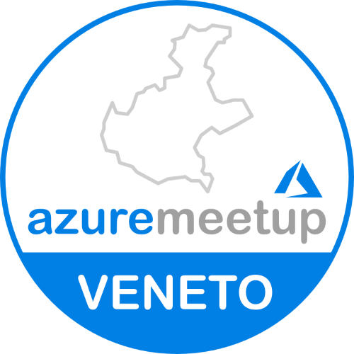

# Global Azure Veneto by Azure Meetup Veneto

Global Azure Veneto is a community event organized by Azure Meetup Veneto.
All around the world user groups and communities are sharing knowledge to professionals that want to learn more about Microsoft Azure and Cloud Computing!
On May 9, 2025, we will come together to once again bring the Global Azure event! Azure Meetup Veneto brings a one day world-class event on Microsoft Azure. Join us online and don't forget to use the social hashtags #GlobalAzureVeneto and #GlobalAzure!

The [Call for Speakers is open](https://sessionize.com/global-azure-veneto-2025). Selection will happen on an ongoing basis. Don't wait to the last day to submit your sessions!!! 

Resume information:
* 📅 May, 9 2025
* 🏠 TBD
* 🎫 TBD
* 🎙️ Call for speakers - [https://sessionize.com/global-azure-veneto-2025](https://sessionize.com/global-azure-veneto-2025)
* 💶 Sponsors - We are looking for sponsors. Reach out to the organization team at [https://www.linkedin.com/company/azuremeetupveneto](https://www.linkedin.com/company/azuremeetupveneto)

If you have any questions, feedback or thoughts, please reach out to the community organizers at:
* https://www.linkedin.com/company/azuremeetupveneto